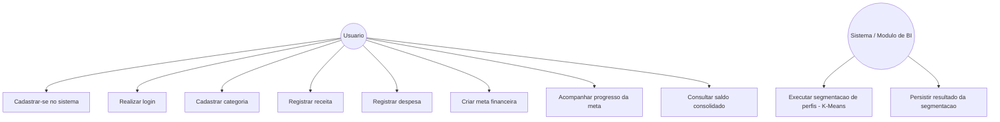

# Documentacao do Projeto - FinanCheck

## 1. Requisitos Funcionais

| Codigo | Descricao |
|---|---|
| RF01 | O sistema deve permitir o cadastro de usuarios com nome, e-mail e senha. |
| RF02 | O sistema deve permitir o login do usuario mediante validacao de credenciais. |
| RF03 | O sistema deve permitir o cadastro de categorias de receita e despesa. |
| RF04 | O sistema deve permitir o registro de receitas, associadas a um usuario e a uma categoria. |
| RF05 | O sistema deve permitir o registro de despesas, associadas a um usuario e a uma categoria. |
| RF06 | O sistema deve permitir a criacao de metas financeiras, com valor objetivo, valor atual, data de inicio e data limite. |
| RF07 | O sistema deve atualizar o status da meta financeira (EM_ANDAMENTO, CONCLUIDA, CANCELADA) conforme o progresso do usuario. |
| RF08 | O sistema deve permitir a consulta consolidada de receitas, despesas e saldo por usuario. |
| RF09 | O sistema deve permitir a segmentacao dos usuarios em perfis financeiros por meio de algoritmo de clusterizacao (K-Means). |
| RF10 | O sistema deve persistir o resultado da segmentacao de perfis, associando cada usuario ao seu cluster. |

## 2. Requisitos Nao Funcionais

| Codigo | Descricao |
|---|---|
| RNF01 | O sistema deve utilizar o SGBD MySQL 8, garantindo suporte a transacoes ACID via engine InnoDB. |
| RNF02 | O banco de dados deve manter integridade referencial por meio de chaves estrangeiras (foreign keys). |
| RNF03 | As senhas dos usuarios devem ser armazenadas de forma protegida (hash), nunca em texto puro. |
| RNF04 | Consultas frequentes (por data e por usuario) devem ser otimizadas por meio de indices dedicados. |
| RNF05 | O processo de mineracao de dados deve ser executado de forma desacoplada do ambiente transacional, sem impactar a performance do sistema principal. |
| RNF06 | O codigo-fonte e os scripts do projeto devem ser versionados em repositorio Git, com historico de commits rastreavel. |
| RNF07 | Informacoes sensiveis (como credenciais de banco de dados) nao devem ser expostas no repositorio publico. |

## 3. Estimativa de Custos

Por se tratar de um projeto academico implementado com ferramentas gratuitas e de codigo aberto, os custos diretos de licenciamento sao nulos. A estimativa abaixo considera um cenario de producao real, para fins de referencia:

| Item | Ferramenta/Servico | Custo estimado |
|---|---|---|
| SGBD | MySQL Community Edition | Gratuito (open source) |
| Ambiente de desenvolvimento | VS Code, MySQL Workbench | Gratuito |
| Linguagem/bibliotecas de mineracao | Python, pandas, scikit-learn, matplotlib | Gratuito (open source) |
| Versionamento de codigo | Git e GitHub (repositorio publico) | Gratuito |
| Hospedagem em producao (cenario hipotetico) | Servidor cloud (ex.: VPS 2 vCPU / 4GB RAM) | Aproximadamente R$ 40 a R$ 100 por mes, dependendo do provedor |
| Backup e armazenamento (cenario hipotetico) | Armazenamento em nuvem para backups periodicos | Aproximadamente R$ 10 a R$ 30 por mes |

## 4. Modelagem UML - Diagrama de Casos de Uso

O diagrama acima representa as principais interacoes entre o ator Usuario e o sistema FinanCheck, alem do modulo interno de Business Intelligence responsavel pela segmentacao automatica de perfis financeiros.

## 5. Artefatos Relacionados

Esta documentacao complementa os demais artefatos do projeto, disponiveis no repositorio:

- Modelo conceitual e logico: descritos no relatorio da primeira entrega (DER e dicionario de dados).
- Modelo fisico: script `sql/ddl.sql` (estrutura transacional) e `sql/clusters.sql` (estrutura analitica).
- Mineracao de dados: `docs/analise_clusters.md`, com todo o processo de analise exploratoria, padronizacao, escolha de K, execucao do K-Means e interpretacao dos resultados.
- Scripts de mineracao: pasta `mineracao/`.
- Visualizacoes: `dados/escolha_k.png` e `dados/visualizacao_clusters.png`.

## 6. Atualizacao do Dicionario de Dados (Modelo Logico)

Durante a construcao do modelo fisico, a tabela `meta_financeira` foi implementada com campos adicionais em relacao ao dicionario de dados apresentado na primeira entrega, necessarios para o correto funcionamento do controle de metas financeiras. A tabela abaixo atualiza a especificacao original.

| Tabela | Campo | Tipo de Dados | Restricoes / Constraints |
|---|---|---|---|
| meta_financeira | id_meta | INT | PK, AUTO_INCREMENT |
| meta_financeira | id_usuario | INT | FK (usuario.id_usuario) |
| meta_financeira | titulo_meta | VARCHAR(150) | NOT NULL |
| meta_financeira | descricao_meta | VARCHAR(255) | - |
| meta_financeira | valor_objetivo | DECIMAL(12,2) | NOT NULL |
| meta_financeira | valor_atual | DECIMAL(12,2) | NOT NULL, DEFAULT 0 |
| meta_financeira | data_inicio | DATE | NOT NULL |
| meta_financeira | data_limite | DATE | NOT NULL |
| meta_financeira | status_meta | ENUM('EM_ANDAMENTO','CONCLUIDA','CANCELADA') | NOT NULL, DEFAULT 'EM_ANDAMENTO' |

Os campos `valor_atual`, `data_inicio` e `status_meta` foram incorporados para permitir o acompanhamento continuo do progresso da meta e a segmentacao de perfis financeiros realizada na etapa de mineracao de dados (ver secao 4 de `docs/analise_clusters.md`), que depende diretamente do campo `status_meta` para validacao cruzada dos clusters formados.

Adicionalmente, a tabela `cluster_usuario`, criada na segunda entrega para persistir o resultado da mineracao de dados, complementa o modelo logico original:

| Tabela | Campo | Tipo de Dados | Restricoes / Constraints |
|---|---|---|---|
| cluster_usuario | id_usuario | INT | PK, FK (usuario.id_usuario) |
| cluster_usuario | cluster | INT | NOT NULL |
| cluster_usuario | total_receitas | DECIMAL(10,2) | - |
| cluster_usuario | total_despesas | DECIMAL(10,2) | - |
| cluster_usuario | saldo | DECIMAL(10,2) | - |
| cluster_usuario | percentual_meta | DECIMAL(5,2) | - |
| cluster_usuario | data_execucao | DATETIME | DEFAULT CURRENT_TIMESTAMP |